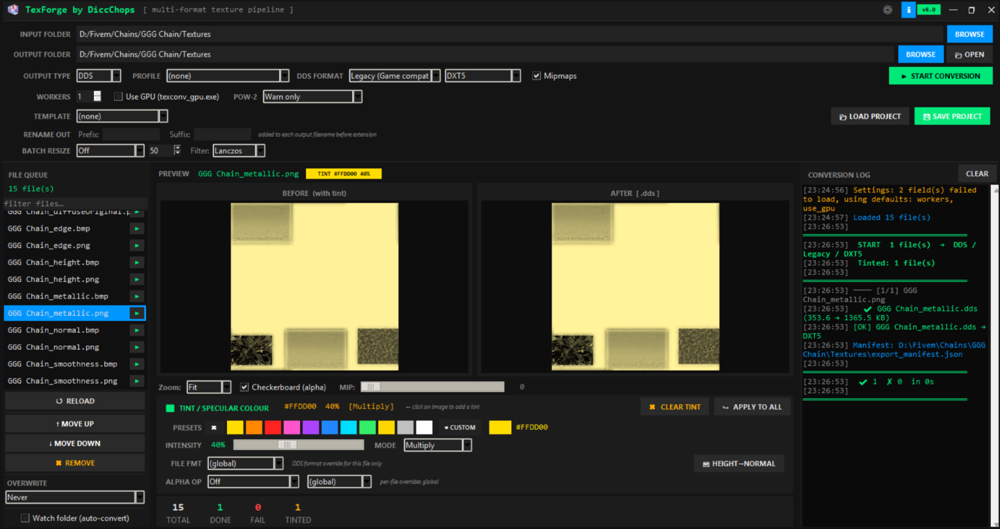
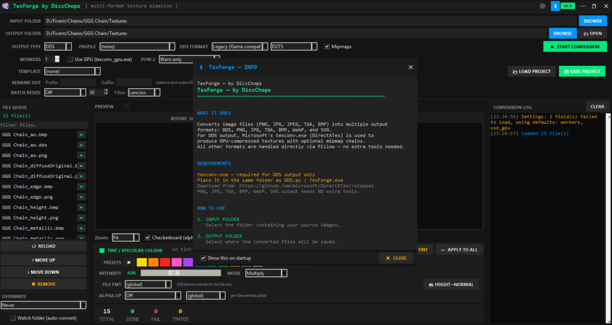

# Texture Pipeline Manager — v8.0
# TexForge — v8.0
> by DiccChops

TexForge is a desktop texture conversion tool built in Python/Tkinter, designed primarily for game modders and 3D artists. It provides a graphical pipeline for batch-converting image files (PNG, JPG, TGA, BMP) into various output formats — most notably DDS (DirectX Surface), the standard texture format used by game engines like GTA V, Skyrim, Unity, and Unreal Engine.

It wraps Microsoft's `texconv.exe` for DDS encoding and uses Pillow for all other format handling and image processing.

## Key capabilities

- **Multi-format output** — DDS (DXT1/3/5, BC4/5/7), PNG, JPG, TGA, BMP, WebP, and SVG.
- **Engine presets** — one-click profiles for FiveM/GTA V, Skyrim, Unity, Unreal, UI sprites, and PBR material workflows.
- **Tint/colorization engine** — apply per-file or batch color tints using blend modes like Multiply, Screen, Overlay, Add, and Lerp.
- **Live before/after preview** — with zoom, checkerboard alpha display, and mipmap level scrubbing.
- **Parallel batch conversion** — multi-worker support for fast processing of large texture libraries.
- **Watch folder mode** — auto-converts new files as they appear in the input folder.
- **Project save/load** — preserves all settings, tints, and per-file overrides as JSON.
- **Headless CLI mode** — scriptable batch conversion without launching the GUI.
- **Structured logging** — per-file JSONL conversion log and an export manifest written to the output folder.

## Why use this tool

- Built for modders and small studios: manage texture conversion jobs, standardize outputs, and generate machine-readable manifests for downstream pipelines.
- Practical defaults (Auto DDS selection, PBR naming heuristics) plus advanced controls (format overrides, versioned outputs).
- Lightweight source (single-file) for inspection and extension, or packaged as a standalone Windows executable.

## Requirements

- Windows 10 / 11 (Win32 features used)
- `texconv.exe` (DirectXTex) — required for DDS output. For GPU acceleration, provide a compatible `texconv_gpu.exe` binary and enable GPU mode in the UI.
- Python 3.x + Pillow to run from source (or use the standalone executable built from this repo)

## Quick start

1. Place `texconv.exe` (or `texconv_gpu.exe`) in the same folder as the app.
2. Launch the app, apply a template or create a new project, set input/output folders.
3. Optionally save a project to reuse settings.
4. Configure `WORKERS` (1..16) and enable GPU if available, then START CONVERSION.

## Projects & templates

- Projects save the full job state as JSON (folders, preset, format, tints). Use SAVE / LOAD PROJECT in the toolbar.
- Templates create `projects/<template>_input` and `projects/<template>_output` under the app folder to bootstrap common workflows.

## Export manifest

- Each conversion run writes `export_manifest.json` into the output folder (overwritten each run). Manifest entries include `file`, `status` (OK/SKIP/FAIL), `format`, `reason`, and `size` — suitable for automated importers or asset catalogs.

## Performance and scaling

- Increase `WORKERS` to parallelize conversions across CPU cores for large batches. The app uses chunking to reduce contention and memory pressure.
- Enable GPU if you have a compatible `texconv_gpu.exe` build for hardware-accelerated block compression.

## Supported Input / Output formats

Supported input: `.png`, `.jpg`, `.jpeg`, `.tga`, `.bmp`, `.dds`, `.webp`

Output formats: `DDS`, `PNG`, `JPG`, `TGA`, `BMP`, `WebP`, `SVG`.

When outputting `DDS`, formats supported include: `DXT1`, `DXT3`, `DXT5`, `BC4_UNORM`, `BC5_UNORM`, `BC7_UNORM`, `R8G8B8A8_UNORM` (UI/Modern choices exposed in the UI).

## Files of interest

- `DDS.py` — main application source (inspect or run directly with Python)
- `projects/` — sample templates and saved project JSON files
- `texforge_conversion.log` — machine-friendly JSONL per-file log (appends during conversion)
- `export_manifest.json` — per-run manifest written into the output folder
- `texforge_crash.log` — crash diagnostics
- `texforge_settings.json` — persisted UI/theme/output settings

## Security & redistribution

- `texconv.exe` is not redistributed. Download it from Microsoft's DirectXTex releases and place it beside the app due to redistribution licensing.

## Support and contribution

Open issues and pull requests are welcome. Describe the target pipeline if you want custom template presets, CI-friendly manifest formats, or other integrations.
